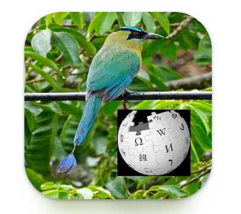

# The Free Wikipedia To Audio - Android

## Description:

Simple project to parse wikipedia articles and listen to those articles in your android device.

No pay fees.
Free and Open Source

May keep updating depending on time.

# License

This project is licensed under the [MIT License](https://opensource.org/licenses/MIT).

## PlayStore

https://play.google.com/store/apps/details?id=wikito.audio
